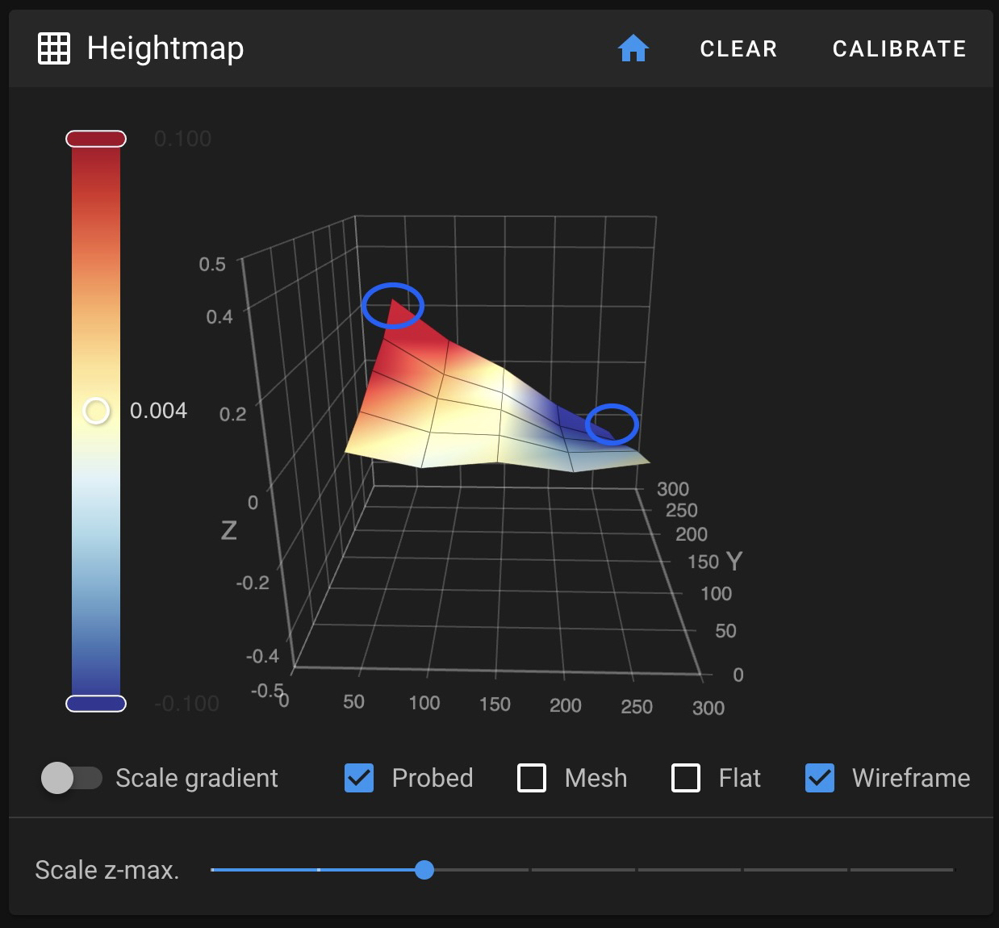

# Fixing a Wonky Trident Bed Mesh

## The Problem

Y extrusions that are not in plane with each other result in an odd mesh. It will appear straight across the front of the bed and the back will have a slant.

This is because a Trident only levels the bed from 3 points near the Z drives so it does not have the means to correct Z height in the back corners.

## Identifying the Issue

Run a bed mesh and look for this pattern:
- Front of the bed appears level (straight line)
- Back of the bed shows a slant
- One back corner will appear red in the mesh visualization

This image shows an example of the wonky mesh and indicates the two points that should be measured:

## Fixing the Issue

1. **Prepare**: Place the printer in its permanent location and ensure the surface it's on is flat and solid.

2. **Measure**: With a mesh active, hover over the two back corner points and see the difference in Z height between them. This difference is the amount you need to adjust.

3. **Adjust**: On the *side that is red* (looks too high), you will adjust the *front* corner *down* by the amount measured in step 2. This is done by loosening the screw for the blind joint on the *front* of the printer in the vertical extrusion. Move that side of the Y extrusion down.

4. **Verify**: Leave the printer powered and leveled while making these adjustments so you can quickly run a Z-Tilt and a bed mesh to see if further adjustment is required.
